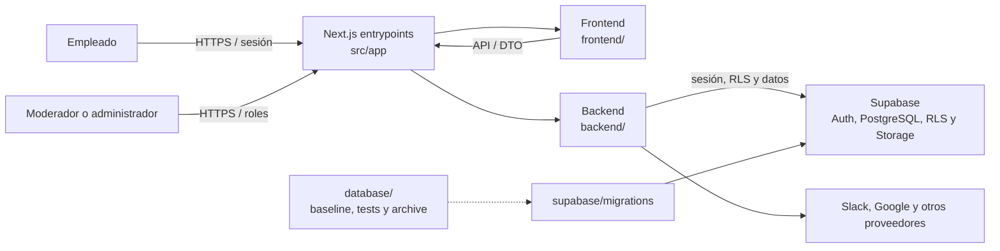

# Outplex — contexto C2

Estado: vigente para la modernización iniciada el 2026-07-31.

## Alcance

Outplex es un hub interno para recompensas, horas extra, tiendas de empleados,
anuncios, formularios, sorteos, soporte y moderación. El sistema conserva un
único despliegue Next.js, con fronteras físicas entre presentación, backend y
ciclo de vida de base de datos.

## Contenedores internos

1. **Frontend:** `frontend/` contiene UI, hooks, estado y adaptadores exclusivos
   del navegador.
2. **Backend:** `backend/` contiene dominio, contratos, casos de uso,
   infraestructura y plataforma servidor.
3. **Base de datos:** `database/` conserva baseline, pruebas y SQL histórico;
   `supabase/migrations/` es la única historia desplegable.
4. **Entry points:** `src/app/` conserva páginas, layouts y Route Handlers porque
   son convenciones obligatorias del App Router; deben delegar en las capas
   anteriores.
5. **Shared:** `shared/` contiene únicamente contratos y utilidades puras.

La separación es física y está protegida por
[dependency-rules.md](dependency-rules.md) y pruebas automatizadas.

## Límites de confianza

- Navegador → aplicación: parámetros, cuerpos, archivos, URLs y estado del
  navegador son no confiables.
- Aplicación → Supabase: `service_role` evade RLS y sólo puede existir en backend
  tras autorización explícita.
- Aplicación → OAuth/proveedores: callbacks y respuestas externas son entradas
  no confiables; tokens y credenciales son secretos.
- CI/CD → producción: secretos, migraciones y despliegues requieren evidencia y
  aprobación del owner.
- Datos por usuario → caché: no entran en cachés compartidas.

## Evidencia y límites

Este contexto se deriva de `README.md`, `.env.example`, `src/app`, `frontend`,
`backend`, `database`, `supabase/migrations` y los tests de arquitectura. No
confirma por sí mismo rotación histórica de secretos, restore, alertas o
aplicación de migraciones en producción; esos puntos siguen siendo gates
externos.
